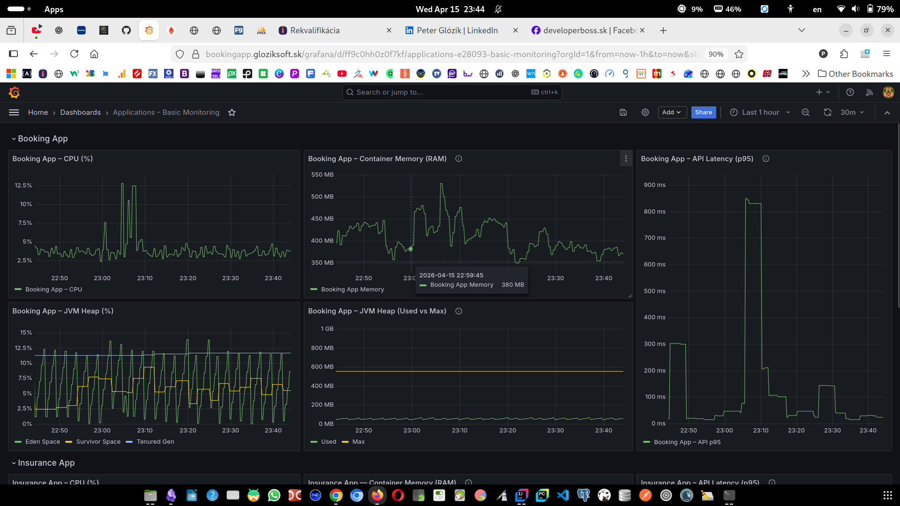
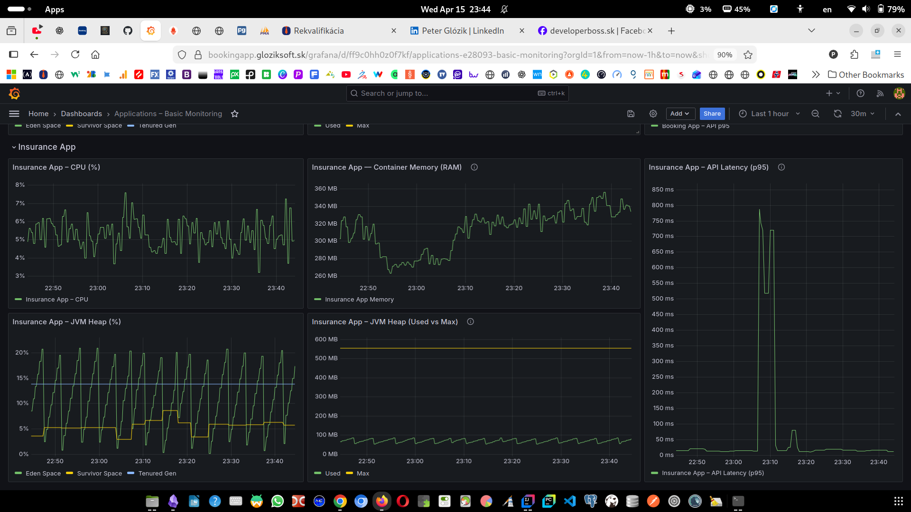
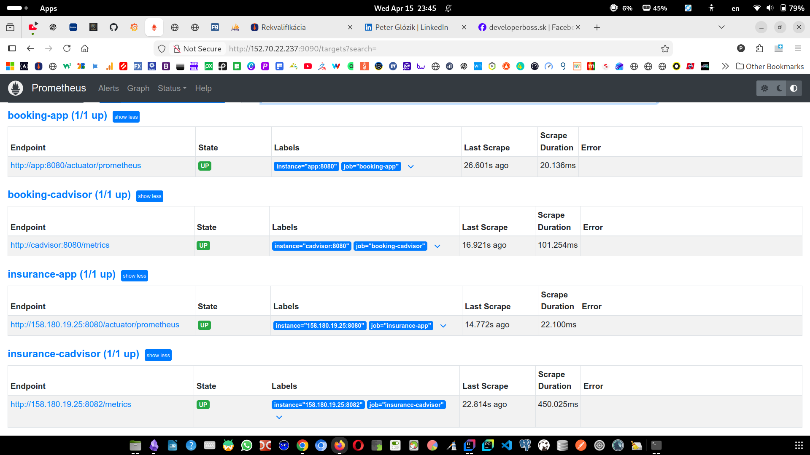
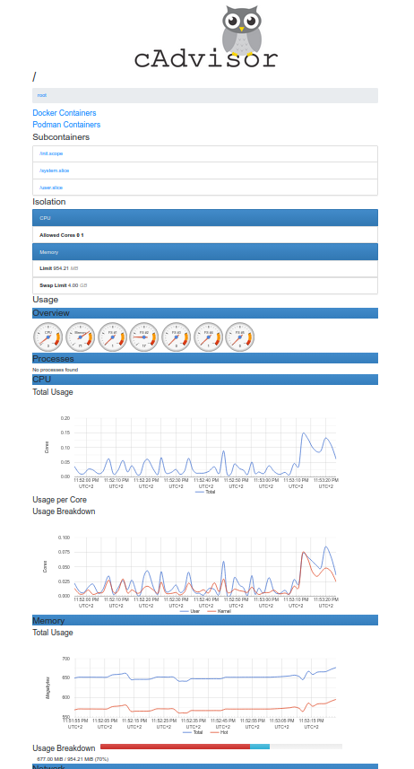
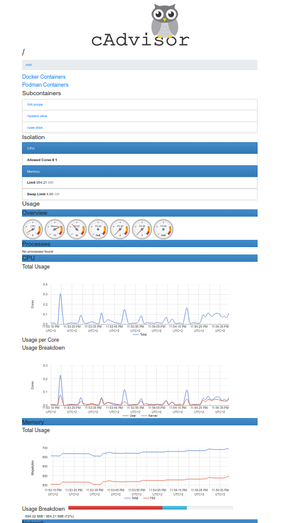

# 👨‍💻 Peter Glózik

**Java Backend Developer | Spring Boot | Docker | CI/CD | Linux | Cloud Deployment**

---

## 🚀 About Me

I focus on building and deploying backend applications using **Spring Boot** and modern DevOps practices.  
My work includes **containerization (Docker)**, **CI/CD pipelines**, **monitoring**, and **deployment on Linux servers with Nginx and SSL**.

---

## 🛠 Tech Stack

* Java (Spring Boot)
* MySQL / PostgreSQL
* Docker & Docker Compose
* Nginx (reverse proxy, SSL)
* Linux
* Git & GitHub
* GitHub Actions (CI/CD)
* Prometheus / Grafana
* Oracle Cloud

---

## 🌐 Live Projects

### 🔹 InsuranceApp

👉 https://insuranceapp.gloziksoft.sk  
👉 https://github.com/Gloziksoft/InsuranceApp  

- Spring Boot REST API  
- MySQL database  
- Docker deployment  
- Nginx + SSL  
- CI/CD  

---

### 🔹 Booking System

👉 https://bookingapp.gloziksoft.sk  
👉 https://github.com/Gloziksoft/Booking_EasyApp  

- Spring Boot backend  
- PostgreSQL database  
- Docker & Compose  
- Oracle Cloud deployment  
- HTTPS with Nginx  

---

## 📊 Monitoring & Observability

I implemented monitoring using:

- Prometheus (metrics collection)
- Grafana (visualization)
- Spring Boot Actuator (metrics)
- cAdvisor (container metrics)

Monitoring stack is fully containerized using Docker Compose.

---

## 🔹 Grafana Dashboards

### Booking App

### Insurance App

---

## 🔹 Prometheus Monitoring

---

## 🔹 Container Monitoring (cAdvisor)

### Booking

### Insurance

---

## ⚙️ What I Focus On

* Backend API development  
* Dockerized applications  
* CI/CD pipelines  
* Monitoring & observability  
* Linux deployment  
* Secure infrastructure (Nginx, SSL)  

---

## 📂 Featured Work

* InsuranceApp – backend + deployment + monitoring  
* Booking System – full-stack + cloud + monitoring  

---

## 🧩 Other Experience

* ASP.NET MVC  
* C# / .NET  
* Umbraco CMS  
* SQL  

---

## 🔗 Contact

* LinkedIn: https://linkedin.com/in/peterglozik  
* GitHub: https://github.com/Gloziksoft  
